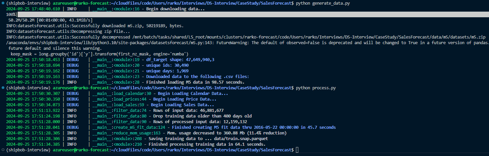
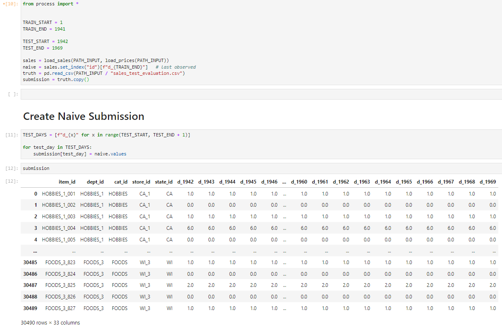

# Data Science Case Study: Demand Forecasting
Demand forecasting is an essential element of Supply Chain planning and inventory optimization.

The aim for this assessment is to demonstrate the ability to design a software-based approach to solving a complex multi-dimensional problem. You aren't expected to use every datapoint given, **or to produce a full solution**, we want to see how you research a problem, budget scarce time, and get a sense of the tools you use and how you fit them into a framework.

___

# Problem Statement
You have been given code that downloads data from the [**M5 Competiton**](https://www.unic.ac.cy/iff/research/forecasting/m-competitions/m5/). The dataset is Walmart sales across 10 stores located in 3 states (CA/TX/WI).
There are ~over ~30k unique items, across 3 categories **(FOODS, HOUSEHOLD, HOBBIES)** covering ~5 years of sales. 

See the **Setup Guide** for instructions on how to produce all the data needed in local .csv files.

## CSV Files Created

### Demmand Data
 1. `sales_train_validation.csv`: sales from `d_1` thru `d_1913` **TRAINING DATA**
 1. `sales_train_evaluation.csv`: sales from `d_1` thru `d_1941` **TRAINING & VALIDATION DATA**
 1. `sales_test_validation.csv`: sales from `d_1914` thru `d_1941` **VALIDATION DATA**
 1. `sales_test_evaluation.csv`: sales from  `d_1942` thru `d_1969` **TEST DATA**

### Calendar Data
 1. `calendar.csv`: DataFrame of unique dates, features and special events
    - `d_1`: `2011-01-29`
    - `d_1969`: `2016-06-19`

### Price Data
 1. `sell_prices.csv`: weekly prices for every item.

___

# Case Study Questions
**A complete solution should address the following**:

1. **Plan an Approach** - what steps to do you plan to follow and why? This can be high-level.
1. **Forecast Generation** - produce a **28 day forecast** (i.e. for each `item_id` predict demand for days `d_1942` thru `d_1969`)
1. **Forecast Evaluation** - how will you evaluate your forecast peformance (how will this differ before/after going live)?
1. **Prepare for Discussion** - your submission will be the starting point for a discussion, be prepared to talk about your solution, assumptions/tradeoffs, expect questions on how this exercise is analogous to data problems faced at Shipbob.

## Bouns Questions **(not required)**
1. **Inventory Optimization** - How would you use the forecast to decide how much of each item to keep in each store? How would you set the optimal restock date? What kinds of additional data inputs would you require to determine these?


# Setup Guide
Feel free to use whatever package manager you like the required libraries will be inside `requirements.txt` see the snippet below for a typical [micromamba](https://mamba.readthedocs.io/en/latest/installation/micromamba-installation.html) `Jupyter` setup (swap micromamba for conda/miniconda/etc.)

### Micromamba Install
```
    micromamba create -n shipbob-interview -c conda-forge python=3.10 -y
    micromamba activate shipbob-interview
    pip install -r requirements.txt
    micromamba run -n shipbob-interview  python3 -m ipykernel install --user --name shipbob-interview --display-name "Shipbob Interview"
```

After installing the required packages you can serialize a local copy of the data by running `generate_data.py` this should only take a few minutes, feel free to sample your data if memory becomes an issue, just explain your reasoning (i.e. sampled top X by volume to fit in memory).

# Generate Data
Run the python scripts below in sequence to download and perform some minimal processing on the Case Study data from the M5.
```
    python generate_data.py
    python process.py
```


# Naive Forecast Notebook
The Naive solution might look something like:




# Case-Study Distribution
Download the git repo and create a compressed copy to email to candidates.

```
    zip -ur DS-CaseStudy-SalesForecast.zip DS-CaseStudy-SalesForecast
    du -h --max-depth=0 DS-CaseStudy-SalesForecast.zip
```
